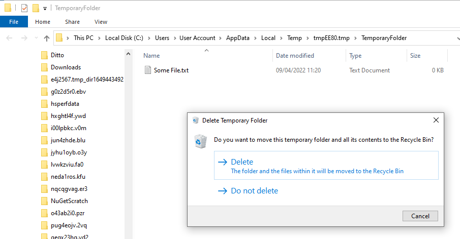

# Temporary Folders
A `%TEMP%` folder designed for humans.

Sometimes you just want somewhere to put a file on disk, but only temporarily. Often this ends up being the desktop, leading to cluttering
the workspace. Or you might use `%TEMP%`, the system location designed for temporary files, but this is usually full of hundreds of other
files making it hard to find the ones you are using.

Temporary Folders provides a way to create a new, empty temporary folder that is automatically deleted when you are finished with it.
The path to the folder is put on the clipboard when it is created, and an Explorer window showing the folder is opened. When you close
the explorer window, you will be prompted to keep or delete the files within it.

## Examples
### Downloading a file an attatching it to an email
Double click the "New Temporary Folder" shortcut, then download the file in the browser
(use Save As if your default settings are to save without prompting for location). The path is already on the clipboard, so paste it
into the save dialog. The file is saved into the Temporary Folder you have open, now you can just drag and drop that onto the email. Or, if
using the file browser to search for a file to attach, paste the path that is still on your clipboard. Your downloaded file(s) will be the
only things in that folder, so are easy to find.

After sending the email, close the folder window, and you will be prompted to delete the folder now that you no longer need it.

### Working with the contents of a zip file
Portable applications or installers in zip files are sometimes more than a single file, and in order
to execute them all the files must be extracted. Or you might want to extract all the files so you can search them or otherwise process them. In
either case, the files need to come out of the zip, but only temporarily while you are working with them.

Double click the "New Temporary Folder" shortcut, then open the zip file, select the contents that you want, then drag and drop them on to the
temporary folder. Now you can run the installer, or search the files, or whatever you need. When finished, close the folder window and the
contents can be easily deleted.

### Executing a script file
If you want to execute a script, it needs to be saved somewhere, but if it's just a temporary script you don't really want to save, create a New
Temporary Folder, paste the automatically copied path into the Save window of your script editor and the script is now ready to run. You can
paste the path into the terminal too.

### Downloading an executable
Firefox requires executables and installers to be saved, rather than executed directly. A Temporary Folder is a good place to use as the download
location.

## Advanced Usage
If you drag and drop files or folders onto the New Temporary Folder shortcut, these files will be moved into the newly created temporary folder,
or copied if the Ctrl key is held down. You can also use the "Send to" context menu in Windows Explorer to send files to a newly created
temporary folder.

When deleting after closing the explorer window, if the Shift key is held when clicking the Delete button, files will be permanently deleted
instead of being sent to the Recycle Bin.

The installer does not assign a hotkey to the start menu shortcut, but I have often found it convenient to do so, for even faster access to
creating a new folder. This can easily be done through the standard windows properties page for the shortcut.